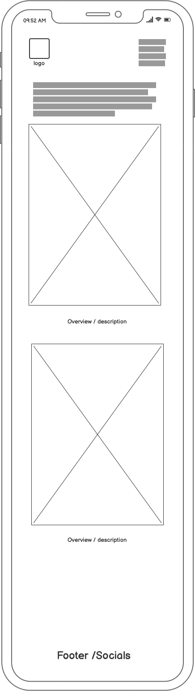
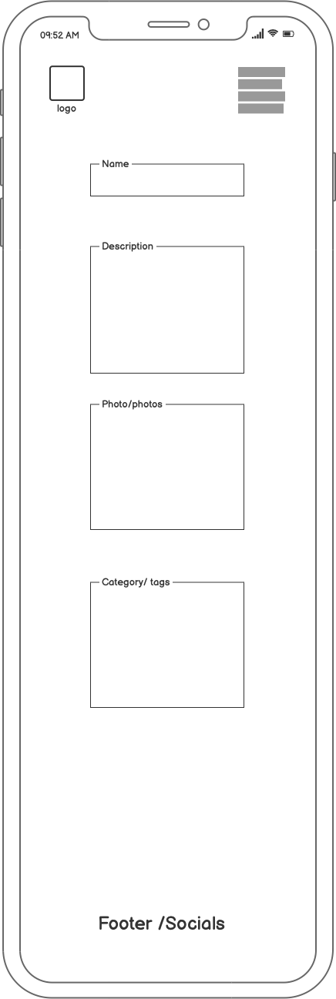
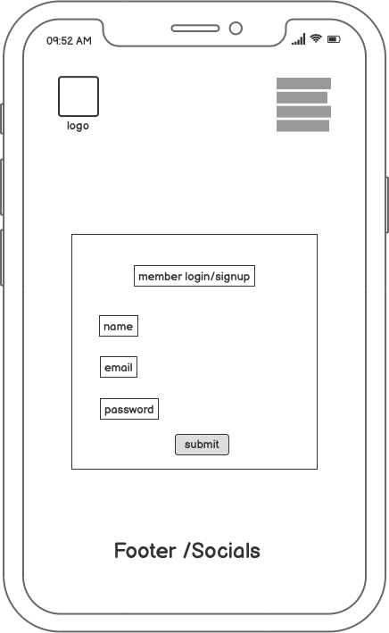

# **Welcome to The Witch's Cauldron**


An online community coven for those who have a solid wiccan / aesoteric practice, or for the curious. 
Members can post their own spells and rituals and tray practices from other members allowing them to greatly expand their knowledge of other wordly rituals. It is perfect for wiccans or wiccan curious who may not b e able to find a local coven, or even those who prefer to practice alone but enjoy learning from others. 

## Demo
View the live project here. https://the-witchs-cauldron.herokuapp.com/


## TOC

- [User Experience (UX)](#user-experience-ux)
  - [Project Aims](#project-aims)
  - [User Stories](#user-stories)
    - [Theme: Acc Management](#Theme-acc-management)
        - [Epic: Register Acc ](#epic-register-acc)
        - [Epic: Sign In ](#epic-sign-in)
        - [Epic: Log Out ](#epic-log-out)
        - [Epic: Customise Profile ](#epic-customise-profile)
    - [Theme: Admin Features](#Theme-admin-features)
        - [Epic: Customise Post ](#epic-customise-post)
        - [Epic: Save Draft ](#epic-save-draft)
    - [Theme: Post Interaction](#Theme-post-interaction)
        - [Epic: View Posts ](#epic-view-posts)
        - [Epic: Save Post ](#epic-save-post)
        - [Epic: Likes and Comments ](#epic-likes-and-comments)

  - [Agile Methodology](#agile-methodology)
  - [Design](#design)
    - [Wireframes](#wireframes)
    - [Colour Scheme](#colour-scheme)
    - [Typography](#typography)
    - [Images and Iconography](#images-and-iconography)
    - [Database Schema](#database-schema)
    - [Design changes](#design-changes)
- [Features](#features)
  - [Features Not Implemented](#features-not-implemented)
  - [Future Features](#future-features)
- [Technologies Used](#technologies-used)
  - [Languages Used](#languages-used)
  - [Python Modules and Packages/Frameworks Used](#python-modules-and-packagesframeworks-used)
  - [Programs and Tools Used](#programs-and-tools-used)
- [Testing](#testing)
  - [Bugs](#bugs)
    - [Fixed Bugs](#fixed-bugs)
    - [Remaining Bugs](#remaining-bugs)
- [Deployment](#deployment)
  - [Forking the GitHub Repository](#forking-the-github-repository)
  - [Making a Local Clone](#making-a-local-clone)
  - [Deploying with Heroku](#deploying-with-heroku)
- [Credits](#credits)
  - [Online resources](#online-resources)
  - [Code](#code)
  - [Media](#media)
  - [Acknowledgments](#acknowledgments)

## User Experience (UX)

### Project Aims

### User Stories

### UX/UI

[GitHub Issue #32](https://github.com/users/rachel-o-donnell/projects/9/views/1?pane=issue&itemId=18662577)

### Theme: Acc Management 
[GitHub Issue #14](https://github.com/rachel-o-donnell/the-witchs-cauldron/issues/14)

### Epic: Register Acc 
[GitHub Issue #15](https://github.com/rachel-o-donnell/the-witchs-cauldron/issues/15)

User Stories: 

1. As a Site User / Admin I can register an account so that I can add comments and like posts [GitHub Issue #6](https://github.com/rachel-o-donnell/the-witchs-cauldron/issues/6) PASS


### Epic: Sign In 
[GitHub Issue #17](https://github.com/rachel-o-donnell/the-witchs-cauldron/issues/17)

User Stories:

1. As a User/admin I can sign in so that I can see my content [GitHub Issue #16](https://github.com/rachel-o-donnell/the-witchs-cauldron/issues/16) PASS

### Epic: Log Out
[GitHub Issue #19](https://github.com/rachel-o-donnell/the-witchs-cauldron/issues/19)

User Stories:

1. As a User/Admin I can log out so that I can log in on different devices - shared computers [GitHub Issue #18](https://github.com/rachel-o-donnell/the-witchs-cauldron/issues/18) PASS


### Theme: Admin Features
[GitHub Issue #21](https://github.com/rachel-o-donnell/the-witchs-cauldron/issues/21)

### Epic: Customise Post
[GitHub Issue #22](https://github.com/rachel-o-donnell/the-witchs-cauldron/issues/22)

User Stories:

1. As a Site Admin I can create, read update and delete posts so that I can manage the content I am submitting to the platform [GitHub Issue #9](https://github.com/rachel-o-donnell/the-witchs-cauldron/issues/9) PASS


1. As a Site Admin I can add a category tag to my post so that users can find my post when looking for a specific topic [GitHub Issue #12](https://github.com/rachel-o-donnell/the-witchs-cauldron/issues/12) PASS


### Theme: Post Interaction
[GitHub Issue #24](https://github.com/rachel-o-donnell/the-witchs-cauldron/issues/24)

User Stories:

As a user/admin I can create,read,update and delete a spell from the front end so that the process of posting is easier [GitHub Issue #46](https://github.com/users/rachel-o-donnell/projects/9/views/1?pane=issue&itemId=20948795) PASS

### Epic: View Posts
[GitHub Issue #25](https://github.com/rachel-o-donnell/the-witchs-cauldron/issues/25)

User Stories:

1. As a Site User I can view a list of posts so that I can choose one to read [GitHub Issue #2](https://github.com/rachel-o-donnell/the-witchs-cauldron/issues/2) PASS


1. As a Site User I can click on a post so that I can read the full spell [GitHub Issue #3](https://github.com/rachel-o-donnell/the-witchs-cauldron/issues/3) PASS

1. As a user I can **see my liked posts from the home screen ** so that I dont have to click into a post to check if I have liked it [GitHub Issue #3](https://github.com/users/rachel-o-donnell/projects/9/views/1?pane=issue&itemId=18620688)
PASS


### Epic: Likes and Comments

[GitHub Issue #26](https://github.com/rachel-o-donnell/the-witchs-cauldron/issues/26)

### EPIC: Advanced likes and comments#34
[GitHub Issue #34](https://github.com/users/rachel-o-donnell/projects/9/views/1?pane=issue&itemId=18620584) PASS

1.  As a user I can edit or delete my comment so that I can amend mistakes [GitHub Issue #37](https://github.com/users/rachel-o-donnell/projects/9/views/1?pane=issue&itemId=18669585) PASS

User Stories: 

1. As a Site User / Admin I can view the comments left on a post so that I can follow conversation generated by the post [GitHub Issue #5](https://github.com/rachel-o-donnell/the-witchs-cauldron/issues/5) PASS

1. As a Site User / Admin I can view the number of likes on a post so that I can see how popular/successful the post is [GitHub Issue #4](https://github.com/rachel-o-donnell/the-witchs-cauldron/issues/4) PASS

1. As a Site User I can leave comments on individual posts so that I can add to the conversation [GitHub Issue #7](https://github.com/rachel-o-donnell/the-witchs-cauldron/issues/7) PASS

1. As a Site User I can like / unlike a spell post so that I can interact with the content [GitHub Issue #8](https://github.com/rachel-o-donnell/the-witchs-cauldron/issues/8) PASS

### Alert Messages

### EPIC: Alert messages
[GitHub Issue #38](https://github.com/users/rachel-o-donnell/projects/9/views/1?pane=issue&itemId=20198268) 
PASS

User Stories: 
As a user I can see an alert message so that my actions have been confirmed
tasks [GitHub Issue #39](https://github.com/rachel-o-donnell/the-witchs-cauldron/issues/39) PASS

As a user I can see alert messages so that I can see if my login, logout and register actions have been successful
[GitHub Issue #40](https://github.com/rachel-o-donnell/the-witchs-cauldron/issues/40) PASS

As a user I can see alert messages so that I get confirmation that my liking a post has been successful
[GitHub Issue #41](https://github.com/rachel-o-donnell/the-witchs-cauldron/issues/41) PASS

### Future Features:

### Features/themes/epics/userstories changed during production or Not Implemented while prioritising an mvp.


Draft of post was taken off when moving to front end form
Multiple categories option was taken off during final iteration.
Comment approval was removed for better user experience.
User profiles was unfinished so moved to future features.


### Approve Comments

1. As a Site Admin I can approve or deny comments added to my content so that filter any comments that go against community guidelines [GitHub Issue #11](https://github.com/rachel-o-donnell/the-witchs-cauldron/issues/11)


### Epic: Save Draft
[GitHub Issue #27](https://github.com/rachel-o-donnell/the-witchs-cauldron/issues/27)

User Stories:

1. As a Site Admin I can create a draft of my post so that I can save my progress and finish the post at a later time [GitHub Issue #10](https://github.com/rachel-o-donnell/the-witchs-cauldron/issues/10) 

### Epic: Customise Profile
[GitHub Issue #20](https://github.com/rachel-o-donnell/the-witchs-cauldron/issues/20)

User Stories:

1. As a Site User/Site Admin I can personalise my profile so that people can see my areas of interest as a site user or areas of speciality as a creator [GitHub Issue #1](https://github.com/rachel-o-donnell/the-witchs-cauldron/issues/1)

### Epic: Save Post
[GitHub Issue #23](https://github.com/rachel-o-donnell/the-witchs-cauldron/issues/23) Future features

User Stories:

1. As a Site User I can save a spell post so that I can have quick access to my favourite spells [GitHub Issue #13](https://github.com/rachel-o-donnell/the-witchs-cauldron/issues/13)


### Agile Methodology

Themes, Epics and User Stories were all divided up and added as issues in the issues tab of Github 


Each Theme, Epic and User Story was given a label(s) to visually connect to the theme or epic it belonged to.


Each Epic and User Story was color coded to have more harmonious connection to the Theme.


User Stories had acceptance criteria/tasks in the form of check boxes. In this example I tested this feature from the admin panel first and added screenshot in the comments as I know I will have to test this function again after I create the views.

[User Story Acceptance criteria](https://github.com/rachel-o-donnell/the-witchs-cauldron/issues/9) 
Here is another example:
[!User Story Acceptance criteria](/assets/images/readme-images/agile/acceptance-criteria%3Atasks.png) 

All issues were coverted to a Github Kanban project board found in the Github Projects tab or by clicking 

[The Witch's Cauldron Kanban Board](https://github.com/users/rachel-o-donnell/projects/9/views/1)

Product Backlogs were created using the Milestones feature in Github. 1 main product board was created 1st and each iteration was drawn from this board in order of priority.

Product Backlog (main) with MoSCoW labels - Screenshot taken at the start of Iteration 2.


Timeboxing was used by creating Iterations in the Milestones tab of Github with each iteration being one week long. 


Issues were added to each iteration at the start of each week using MosCow prioritisation (with new labels added to each issue) and using the 60% 20% rest method. These issues were also ordered from top priority on the top of the list down.

Issues that were not completed were added back into the main Product Backlog Milestone at the end of each iteration and the board was reprioritised.


1st week I was ahead of my iteration so I began working on 2nd iteration early.


The current iteration led the management of the kanban board- again laid out with a product backlog style in mind with prioritised issues on the top of the list. This helped me visually focus as you could no longer see the MoSCoW labels without clicking into each item. 

Kanban Iteration 1


Kanban Iteration 1 Day 4 progress

 

Kanban Iteration 5 


Kanban Iteration 6


Kanban Final Iteration 
During the final iteration it became clear that I would not have time to finish the profiles I had started so I decided to add it to my future features list and complete the front end of posting content. Originally I had wanted only admins to post but I thought it best to have all users post for better community engagement.


Kanban Final Iteration FUTURE FEATURES

At the final iteration I created a future features section in the kanban board. All issues that had been marked as could have/should have/wont have that never made it through production have been added to the future features section on the kanban board fo ease of access for developing the site further. 


### Design

### Wireframes

Wireframes were created using Balsamiq and can be found [here](assets/images/readme-images/wireframes)






### Colour Scheme

Neutral natural colors were chosen for the site using Coolers. I made every effort for color blind accesability here to ensure all tones would differ. 


All colorblind variants can be found [here](/assets/images/readme-images/colors)

As I was styling the project along the way I realised that the site had much better impact with the use of tints of the colour in the background and that it was a much better ux/ui to have black writing and a white background. 


### Typography

Amatic SC - playful and homemade - a nod to the inviting and not so serious nature of the blog.


Amiri - Has an early modern feel like - the classical period of witch hunts.


### Images and Iconography

3 images were drawn up using Procreate and an Apple Pencil on an IPad.

I wanted the images to be playful, homemade, rough around the edges much like the community and aesoteric practices. The site wants to draw community members in as it can be quite an intimidating interest. 

Cauldron: though most wiccans just use whatever is lying aroung the iconic image of bubbling cauldron is perfect for this melting pot of practices. 


Broom: The broom is indeed a part of many rituals of sweeping bad energy out of the area, so I thought it perfect as a way to "clean up" your mistakes on the site with the edit and delete features. 


Hat: A pointy witches hat 

Though only two are used on the current live site - The hat was to be a default profile image and relate to all profile pages.

### Database Schema

I used DrawSQL to map out my database 


### Design changes

colors - much preferred going with cleaner simpler colors - white - no greys. The black writing was better visually than the dark grey and better visibility.

initially I wanted to override the bootstrap blue color and the alert messages but I think they went really well when I simplified the color sheme.

## Features

1. Home Page

The home page is where you will find the welcome banner , all the blog posts, the nav links and the footer. 


    - 

1. Navigation


    - A clear navigation is consistent across all pages and only changes when user is logged in or logged out.
    - A dropdown button is on the navbar so Users can easily search spells under different categories. 

    

      

1. Signup, Login and other account management pages

    - All auth was used for the account management - Log in, register, loggout. User is prompted to fill all fields correctly and have a more complex password. 

     
     
     

1. Messages

    - ALert messages appear on the top of the relevant screen confirming your actions if necessary. 

    
    
    
    

1. Posts

    - All posts have CRUD functionality and Users can like and comment on posts. 

    - CREATE
     - Summernote Widgets were applied to allow the user to create bullet points, steps, paragraphs etc 

     
     - Users can upload their own image or a default logo image will be used in its place


    - READ
     - Users can like and comment on a spell from this page.
     

     


    - UPDATE

     - Users can edit or delete a spell but the buttons only appear if the user is the creator of the spell.

     

     

    - DELETE
     


1. Comments 


    -  Comments have full crud functionality. 
    
   -  Users can comment on a spell but you must be signed in to do so
     - 
     - 


1. Categories

    - Users can search all posts by using the dropdown categories button
    - Posts will automatically be given a general category if the creator has not chosen one
     - 


1. Error Pages

    - 404, 403 and 500 pages have been styled and are in place.
    - 


1. Footer

    -   Social Media links open in a new tab to allow users to follow on xocial media
    -   Clicking the logo link at the copyright will bring you to the home page
    - 


### Future Features

- Contact us  - apply to become an admin/ submit a spell
- Sign in/up with social media
- Admin profile pages -about us 
- User Profile pages
- Favourites/Saved/Liked posts page
- Follow Admin profiles - notifications of their new posts
- Notifications of replies to comments
- Merch for sale
- Books from creators for sale / reccomendations
- Admin page on frontend to upload spells
- Creation of new Categories by User/admin on front end
- Full Crud Profile feature. 

## Technologies Used

### Languages Used

- HTML5
- CSS3
- Python

### Python Modules and Packages/Frameworks Used

 - [gunicorn](https://pypi.org/project/gunicorn/20.1.0/) - Gunicorn ‘Green Unicorn’ is a Python WSGI HTTP Server for UNIX. (The server that I am useing to run Django on Heroku)
 - [Django](https://www.djangoproject.com/) - High-level Python Web framework used to build this project rapidly.
 
 API: 
 - [cloudinary](https://cloudinary.com/) - Image and Video API
 
 Libraries:
  - [dj-database-url](https://pypi.org/project/dj-database-url/) - Django utility allows use of DATABASE_URL environment variable to configure your Django app.  
    (Support library needed for PostgresSQL - Found in Django settings file to connect to a PostgreSQL database.)
  - [psycopg2](https://pypi.org/project/psycopg2/) - PostgreSQL database adapter for Python. (Connects to PostgresSQL)
  - [dj3-cloudinary-storage](https://pypi.org/project/dj3-cloudinary-storage/) - Django package that facilitates integration with Cloudinary by implementing Django Storage API.
  - [django-summernote](https://summernote.org/) - WISIWYG (what you see is what you get) text editor
  - [django-allauth](https://django-allauth.readthedocs.io/en/latest/) - integrated Django application addressing authentication, registration, account management and sign in from social media. Used to set up an account, like, comment etc.
  - [django-crispy-forms](https://django-crispy-forms.readthedocs.io/en/latest/install.html#installing-django-crispy-forms) - Used for form  elements for comments

 - [whitenoise] - (https://whitenoise.evans.io/en/latest/) - problem with heroku not reading css 
 - [django.contrib.messages]https://docs.djangoproject.com/en/4.1/ref/contrib/messages/

 Deployment:
 - [Heroku](https://dashboard.heroku.com/) - "Heroku is a platform as a service (PaaS) that enables developers to build, run, and operate applications entirely in the cloud."
 Database:
 - [ElephantSQL](https://www.elephantsql.com/) - "ElephantSQL automates every part of setup and running of PostgreSQL clusters." (Database)

### Programs and Tools Used

- [Google Fonts:](https://fonts.google.com/)- [Bootstrap](https://getbootstrap.com/)

- [Bootstrap](https://getbootstrap.com/
  - Bootstrap was used through the project to style the project and create responsive elements/layouts.

- [drawSQL](https://drawsql.app/) - Create Database Schema/ERD
- [Git](https://git-scm.com/)
  - Git was used for version control, using the terminal to commit to Git and
    Push to GitHub.
- [GitHub:](https://github.com/)
  - GitHub is used to store the projects code after being pushed from Git.
- [Balsamiq:](https://balsamiq.com/)
  - Balsamiq was used to create the [wireframes](#wireframes) during the design
    process.
- [Coolors](https://coolors.co/image-recolor)

## Testing

A separate extensive testing file can be found here
[TESTING.md](/docs/testing.md)

### Bugs

### Fixed Bugs

#1 Missing comma after 'cloudinary_storage' in INSTALLED_APPS section of Settings.py creating error ModuleNotFoundError: No module named 'cloudinary_storagedjango' found when dry running migration.

#2 in PostSpell/models.py:
 Fix bug#2 in PostSpell/models.py. Missing capital F in CharField and SlugField creating  AttributeError: module 'django.db.models' has no attribute 'Slugfield'/'CharField' found in migration dry run. 

#3 Default image was not displaying - I needed to change the address. image by Jalyn Bryce.

#4 Username and body not displaying in comment section - changed to user.username and comment_area 

#5 Comment area would disapear after adding comment needed to rearrange the code

#6 Heroku deployment crash - 1st fix was an attempt but incorrect - I had not added crispy forms to requirements.txt.

#7 - alert messages were not showing on edit_comment leading me to realised I had not set them up correctly to display. Needed to add custom messages to respective views, -set import a mixin for class based views, set up the call to show the messages in the base.html and override the django/bootsrap clash in settings.

#8 - SuccessMessageMixin does not work on Deleteview https://code.djangoproject.com/ticket/21926 needed to add workound code found https://stackoverflow.com/questions/24822509/success-message-in-deleteview-not-shown ans:Heyl1

#9 - Site not loading after pep8 compliance - undid shortening of lines for pep8 in env.py and settings.py

#10 - Can't have unique=true with a default setting in models. 

#11 - Import User to Views.py 

#12 - Wrong user showing in profile - I was calling User pk instead of Profile pk 

#13 - CSRF token missing error - needed to import and add request context to View AddSpell https://stackoverflow.com/questions/8321217/django-csrf-token-missing-or-incorrect

#14 - Errors in views after deleteing status from model - forgot to remove ALL status calls/filters from views.py

#15 - Removed queryset from views causing failure to view posts. Re added without status filters

#16 - warnings.warn(f"No directory at: {root}") when debug set to False - needed to change the placement of my whitenoise middleware http://whitenoise.evans.io/en/latest/django.html

#17 - 403 error in edit/delete comments needed to get to user.username.

#18 - distortion of list display when looking under categories corrected layout

#19 - Sumernote widgets causing multiple errors in validation - removed from forms.py after consultation with TA 

#20 - Styling changes for responsiveness Navbar running over in mobile view, crowded edit and delete buttons in mobile view 

#21 - Categories not applying when posting spells - needed to change my logic and simplify due to time contraints - Category model changed to Foreign key and changed forms and views to fix. Only one category can be added per post. 

#22 - Edit a spell page not styled.

#23 - Spell form not registering styling on front end after removal of widget - paragraphs/new lines etc  - re-added summernote widget and updated setting.py with resposive width

### Remaining Bugs

Realised at bug #22 that that using # connects to userstories and project boards on the commit messages and not just a refernece for readme. 

### BUGS found in validation / TESTING

Various Html fixes
#19 Sumernote widgets causing multiple errors in validation
#20 edit and delete comment buttons crowded in mobile view, navbar too long
#21 Categories not applying when posting spells
Areas that should have hover but do not 
Edit a spell page not styled
#23 Sumernote widgets needed to add better readability on posts. 
Changed images to webp format and ensured img-fluid class on all images 

## Deployment

**DO NOT COMMIT AND PUSH ANYTHING IN GITHUB UNTIL YOU HAVE HIDDEN THE SECRET KEY**

### Forking the GitHub Repository

By forking the GitHub Repository we make a copy of the original repository on
our GitHub account to view and/or make changes without affecting the original
repository by using the following steps...

1. Log in to GitHub and locate the [GitHub
   Repository](https://github.com/ianmeigh/support-hub)
1. At the top of the Repository (not top of page) just above the "Settings"
   Button on the menu, locate the "Fork" Button.
1. Click the button (not the number to the right) and you should now have a copy
   of the original repository in your GitHub account.

### Making a Local Clone

1. Log in to GitHub and locate the [GitHub Repository](https://github.com/rachel-o-donnell/the-witchs-cauldron).
1. Under the repository name, click "Code".
1. To clone the repository using HTTPS, under "HTTPS", copy the link.
1. Open your local terminal with git installed
1. Change the current working directory to the location where you want the cloned directory to be created.
1. Type `git clone`, and then paste the URL you copied in Step 3.

    ```console
    ~$ git clone https://github.com/rachel-o-donnell/the-witchs-cauldron
    ```

1. Press Enter. Your local clone will be created.

    ```console
    $ git clone https://github.com/rachel-o-donnell/the-witchs-cauldron
    > Cloning into `test-dir`...
    > remote: Counting objects: 10, done.
    > remote: Compressing objects: 100% (8/8), done.
    > remove: Total 10 (delta 1), reused 10 (delta 1)
    > Unpacking objects: 100% (10/10), done.
    ```

    [Click here](https://help.github.com/en/github/creating-cloning-and-archiving-repositories/cloning-a-repository#cloning-a-repository-to-github-desktop) for a more detailed explanation of the process above with pictures.

1. Change the current working directory to the cloned project folder (this will be a child directory in the location you cloned the project).

1. It is recommended to use a virtual environment during development ([learn more about virtual environments](https://realpython.com/python-virtual-environments-a-primer/)). If you would prefer not to use on please skip the following steps:
    1. Create a virtual environment in the projects working directory by entering the following command in the same terminal window used for the steps above `python3 -m venv .venv`.
    1. Before use, the virtual environment will need to be activated using the command `source .venv/bin/activate` in the same terminal window used previously.
1. Packages required by the project can now using the command `pip install -r requirements.txt`
1. In the cloned directory, rename the file `.env-example` to `.env` and populate it with the information required.
1. Make django migrations using the command `python3 manage.py makemigrations`

### DATABASE
Create an account and set up a project with ElephantSQL. Steps can be found here. [elephansql](https://www.elephantsql.com/docs/)

### Deploying with Heroku

**NOTE**: It is a prerequisite of deployment to Heroku that you already have access to the following:

- A Cloudinary account, create one for free at [https://cloudinary.com](https://cloudinary.com).

**NOTE**: It is assumed you have followed all deployment instructions listed in this readme starting with the section titled 'Forking the GitHub Repository'.

1. Log in to [Heroku](https://www.heroku.com/) and if not taken there automatically, navigate to your personal app dashboard.
1. At the top of the page locate the 'New' drop down, click it and then select 'Create new app'.
1. Give your application a unique name, select a region appropriate to your location and click the 'Create app' button.
1. Your app should now be created, so from the menu towards the top of the page select the 'Resources' section.
1. Search for 'Heroku Postgres' under the Add-ons section and add it.
1. From the menu towards the top of the page select the 'Settings' section and lick 'Reveal Config Vars' in the Config vars section. Enter the following key / value pairings:
    1. Key as `ALLOWED_HOSTS` and the value as the name of you project with '.herokuapp.com' appended to the end e.g.  `example-app.herokuapp.com`. Click the Add button.
    1. Key as `CLOUDINARY_URL` and the value as your cloudinary API Environment variable e.g. `cloudinary://**************:**************@*********`. Click the Add button.
    1. Key as `SECRET_KEY` and the value as a complex string which will be used to provide cryptographic signing. The use of a secret key generator is recommended such as [https://djecrety.ir](https://djecrety.ir/). Click the Add button.

    1. `DataBase` as the `url link` from your elephantsql project.
    1. Set `PORT`  value as `8000`
Django (Framework)
    1. The `DATABASE_URL` should be copied into your local `.env`, created during the cloning process.
1. Open the `.env` file in the project directory and delete the key / value pair `DEV_ENVIRONMENT_DATABASE = True` before saving the file. This can be added back after the next step to ensure local development changes will not alter the remote database.
1. Running migrations on the remote database
    1. Open your local terminal and change the current working directory to that of the project folder.
    1. Make django migrations using the command `python3 manage.py migrate`.
1. Navigate to the 'Deploy' page using the menu towards the top of the page.
1. Select 'GitHub' from the 'Deployment method' section and you will be prompted to 'Connect to GitHub'.
1. Once connected to your GitHub account you will be able to search for your repository which contains the forked 'The Witchs Cauldron' repository.
1. Once the repository is found click 'Connect'.
1. At the bottom of the page find the section named 'Manual deploy', select the 'main' branch in the drop down and click the 'Deploy' button.
1. Once deployment is complete, click the 'View' button to load the URL of the deployed application.

**SET DEBUG TO FALSE IN SETTINGS.PY BEFORE FINAL DEPLOYMENT**

## Credits

### Online resources

- [Django Documentation](https://docs.djangoproject.com/en/3.2/)
- [Bootstrap Documentation](https://getbootstrap.com/docs/5.1) and [Examples](https://getbootstrap.com/docs/5.1/examples/)
- [Django-Summernote Documentation](https://github.com/summernote/django-summernote)
- [Django-Allauth Documentation](https://django-allauth.readthedocs.io/en/latest/)

### Code

Using Code Institute's "I Think Therefore I Blog" runthrough as a base for guidence and adapting as much as possible.

***admin.py - PostAdmin and Admin comment - Add features to expand/make different (minimal I could change here yet- possibly add a category tag if that becomes a feature later on)

Footer - Base code example and addapted to suit the needs and style of the project https://mdbootstrap.com/snippets/standard/mdbootstrap/2885129?view=side

justify-content-end not working when copied from bootstrap - needed to add to the parent. Anurag Srivastava: https://stackoverflow.com/questions/61174994/bootstrap-justify-content-end-not-working-as-expected

Fixing footer styling to push to the bottom of the screen but not sticky : https://radu.link/make-footer-stay-bottom-page-bootstrap/

Adding Categories model and dropdown view: https://www.youtube.com/watch?v=S9-Bt1JgRjQ

Edit Comment functionality : https://www.youtube.com/watch?v=qYOrepWooV4&list=PLKnjLEpehhFnb210PantMg9sdQNrygxUL&index=42

Messages: https://www.youtube.com/watch?v=2rZqhLo-V14&list=PLKnjLEpehhFnb210PantMg9sdQNrygxUL&index=18 implementing alerts to multiple areas
https://ordinarycoders.com/blog/article/django-messages-framework

Messages on a class based view: https://dev.to/serhatteker/show-message-in-class-based-views-django-4a4d

Adding Profiles:

https://www.devhandbook.com/django/user-profile/
https://www.youtube.com/watch?v=zb4fIvtn4tY Codemy


Adding help text to forms field https://stackoverflow.com/posts/50873523/edit

Crud for posts: Codemy
https://github.com/flatplanet/djangoblog (Code for walkthrough videos)
Edit: https://www.youtube.com/watch?v=R6-pB5PAA6s&list=PLCC34OHNcOtr025c1kHSPrnP18YPB-NFi&index=23
Delete:
https://www.youtube.com/watch?v=8NPOwmtupiI&list=PLCC34OHNcOtr025c1kHSPrnP18YPB-NFi&index=7

Changing the width of Summernote widgets: https://morioh.com/p/64e991b05547

Reference projects:
https://github.com/ianmeigh/support-hub
https://github.com/KarinOldbring/vegan-a-eat
https://github.com/dougiemath/photo_sharing_site
https://github.com/Iris-Smok/The-Healthy-Family-PP4

### Media and blog post content
ALL content is being used for educational purposes only.

- https://www.allure.com/story/moon-phases-magic-spells
- https://www.alittlesparkofjoy.com/five-card-tarot-spread/
- https://www.simplemysticmiracles.com/magickspells/freespells.php?gclid=Cj0KCQiAo-yfBhD_ARIsANr56g6PxWJJY1RVegBRDEFd3g8_AW3CpMnRfUapPehoSEfMqxgLP_1Ki9AaAuwUEALw_wcB
-https://yogandha.com/blogs/the-mindful-essential-oils-edit/6-celtic-rituals-to-do-in-may
- 

### ReadMe 

I used the skeleton of Ian's ReadMe to help me put a structure of my ReadMe together as a starting point. 

- https://github.com/ianmeigh/support-hub/blob/main/README.md 

I also used his testing.md structure as a skeleton and ideas to add docs with links, links to projects board etc. 

Tips from the below video README: Worth Reading, with Joanna Gorska on the Code Institute Channel.
- https://www.youtube.com/watch?v=P1UiUXrp7Ic

- The very detailed deployment was also taken from his READMe and altered to suit. 

### Acknowledgments

Huge thanks to my cohort members Ivette McDermott and Roslyn Welch for helping me troubleshoot issues, our cohort lead Iris Smok, Code Institute's Tutor Assistants and my mentor Richard Wells.

