# **Welcome to The Witch's Cauldron**

## Demo

[View the live project here.]

## TOC

- [User Experience (UX)](#user-experience-ux)
  - [Project Aims](#project-aims)
  - [User Stories](#user-stories)
    - [Theme: Acc Management](#Theme-acc-management)
        - [Epic: Register Acc ](#epic-register-acc)
        - [Epic: Sign In ](#epic-sign-in)
        - [Epic: Log Out ](#epic-log-out)
        - [Epic: Customise Profile ](#epic-customise-profile)
    - [Theme: Admin Features](#Theme-admin-features)
        - [Epic: Customise Post ](#epic-customise-post)
        - [Epic: Save Draft ](#epic-save-draft)
    - [Theme: Post Interaction](#Theme-post-interaction)
        - [Epic: View Posts ](#epic-view-posts)
        - [Epic: Save Post ](#epic-save-post)
        - [Epic: Likes and Comments ](#epic-likes-and-comments)

  - [Agile Methodology](#agile-methodology)
  - [Design](#design)
    - [Wireframes](#wireframes)
    - [Colour Scheme](#colour-scheme)
    - [Typography](#typography)
    - [Images and Iconography](#images-and-iconography)
    - [Database Schema](#database-schema)
    - [Design changes](#design-changes)
- [Features](#features)
  - [Features Not Implemented](#features-not-implemented)
  - [Future Features](#future-features)
- [Technologies Used](#technologies-used)
  - [Languages Used](#languages-used)
  - [Python Modules and Packages/Frameworks Used](#python-modules-and-packagesframeworks-used)
  - [Programs and Tools Used](#programs-and-tools-used)
- [Testing](#testing)
  - [Bugs](#bugs)
    - [Fixed Bugs](#fixed-bugs)
    - [Remaining Bugs](#remaining-bugs)
- [Deployment](#deployment)
  - [Forking the GitHub Repository](#forking-the-github-repository)
  - [Making a Local Clone](#making-a-local-clone)
  - [Deploying with Heroku](#deploying-with-heroku)
- [Credits](#credits)
  - [Online resources](#online-resources)
  - [Code](#code)
  - [Media](#media)
  - [Acknowledgments](#acknowledgments)

## User Experience (UX)

### Project Aims

### User Stories

### Theme: Acc Management 
[GitHub Issue #14](https://github.com/rachel-o-donnell/the-witchs-cauldron/issues/14)

### Epic: Register Acc 
[GitHub Issue #15](https://github.com/rachel-o-donnell/the-witchs-cauldron/issues/15)

User Stories: 

1. As a Site User / Admin I can register an account so that I can add comments and like posts [GitHub Issue #6](https://github.com/rachel-o-donnell/the-witchs-cauldron/issues/6)

### Epic: Sign In 
[GitHub Issue #17](https://github.com/rachel-o-donnell/the-witchs-cauldron/issues/17)

User Stories:

1. As a User/admin I can sign in so that I can see my content [GitHub Issue #16](https://github.com/rachel-o-donnell/the-witchs-cauldron/issues/16)

### Epic: Log Out
[GitHub Issue #19](https://github.com/rachel-o-donnell/the-witchs-cauldron/issues/19)

User Stories:

1. As a User/Admin I can log out so that I can log in on different devices - shared computers [GitHub Issue #18](https://github.com/rachel-o-donnell/the-witchs-cauldron/issues/18)

### Epic: Customise Profile
[GitHub Issue #20](https://github.com/rachel-o-donnell/the-witchs-cauldron/issues/20)

User Stories:

1. As a Site User/Site Admin I can personalise my profile so that people can see my areas of interest as a site user or areas of speciality as a creator [GitHub Issue #1](https://github.com/rachel-o-donnell/the-witchs-cauldron/issues/1)

### Theme: Admin Features
[GitHub Issue #21](https://github.com/rachel-o-donnell/the-witchs-cauldron/issues/21)

### Epic: Customise Post
[GitHub Issue #22](https://github.com/rachel-o-donnell/the-witchs-cauldron/issues/22)

User Stories:

1. As a Site Admin I can create, read update and delete posts so that I can manage the content I am submitting to the platform [GitHub Issue #9](https://github.com/rachel-o-donnell/the-witchs-cauldron/issues/9)

1. As a Site Admin I can approve or deny comments added to my content so that filter any comments that go against community guidelines [GitHub Issue #11](https://github.com/rachel-o-donnell/the-witchs-cauldron/issues/11)

1. As a Site Admin I can add a category tag to my post so that users can find my post when looking for a specific topic [GitHub Issue #12](https://github.com/rachel-o-donnell/the-witchs-cauldron/issues/12)

### Epic: Save Draft
[GitHub Issue #27](https://github.com/rachel-o-donnell/the-witchs-cauldron/issues/27)

User Stories:

1. As a Site Admin I can create a draft of my post so that I can save my progress and finish the post at a later time [GitHub Issue #10](https://github.com/rachel-o-donnell/the-witchs-cauldron/issues/10)

### Theme: Post Interaction
[GitHub Issue #24](https://github.com/rachel-o-donnell/the-witchs-cauldron/issues/24)

### Epic: View Posts
[GitHub Issue #25](https://github.com/rachel-o-donnell/the-witchs-cauldron/issues/25)

User Stories:

1. As a Site User I can view a list of posts so that I can choose one to read [GitHub Issue #2](https://github.com/rachel-o-donnell/the-witchs-cauldron/issues/2)
1. As a Site User I can click on a post so that I can read the full spell [GitHub Issue #3](https://github.com/rachel-o-donnell/the-witchs-cauldron/issues/3)

### Epic: Save Post
[GitHub Issue #23](https://github.com/rachel-o-donnell/the-witchs-cauldron/issues/23)

User Stories:

1. As a Site User I can save a spell post so that I can have quick access to my favourite spells [GitHub Issue #13](https://github.com/rachel-o-donnell/the-witchs-cauldron/issues/13)

### Epic: Likes and Comments
[GitHub Issue #26](https://github.com/rachel-o-donnell/the-witchs-cauldron/issues/26)

User Stories: 

1. As a Site User / Admin I can view the comments left on a post so that I can follow conversation generated by the post [GitHub Issue #5](https://github.com/rachel-o-donnell/the-witchs-cauldron/issues/5)
1. As a Site User / Admin I can view the number of likes on a post so that I can see how popular/successful the post is [GitHub Issue #4](https://github.com/rachel-o-donnell/the-witchs-cauldron/issues/4)
1. As a Site User I can leave comments on individual posts so that I can add to the conversation [GitHub Issue #7](https://github.com/rachel-o-donnell/the-witchs-cauldron/issues/7)
1. As a Site User I can like / unlike a spell post so that I can interact with the content [GitHub Issue #8](https://github.com/rachel-o-donnell/the-witchs-cauldron/issues/8)

### Agile Methodology

Themes, Epics and User Stories were all divided up and added as issues in the issues tab of Github 

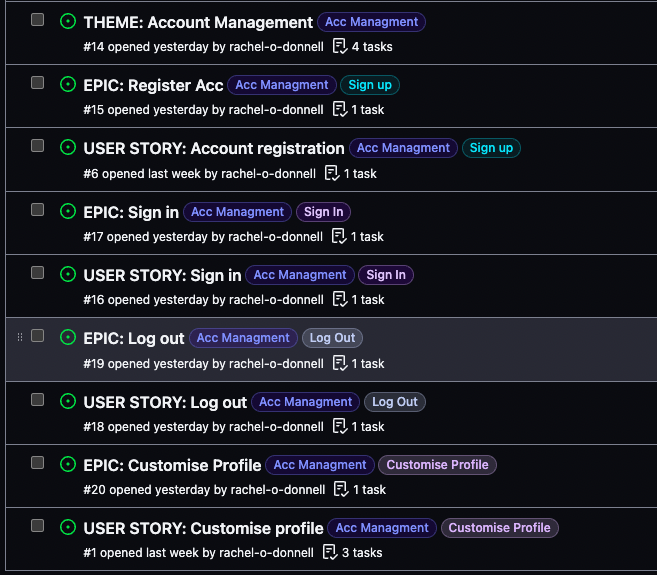

Each Theme, Epic and User Story was given a label(s) to visually connect to the theme or epic it belonged to.

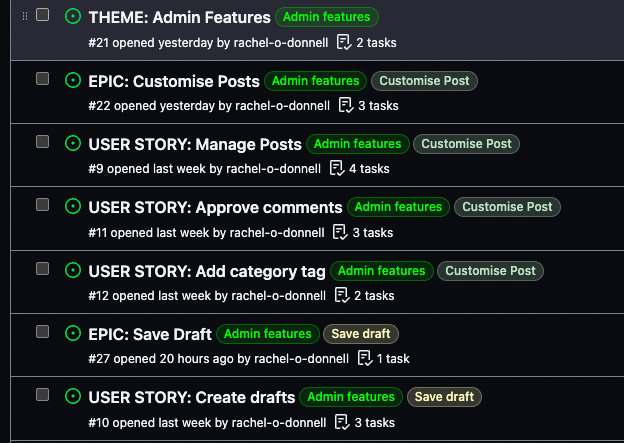

Each Epic and User Story was color coded to have more harmonious connection to the Theme.

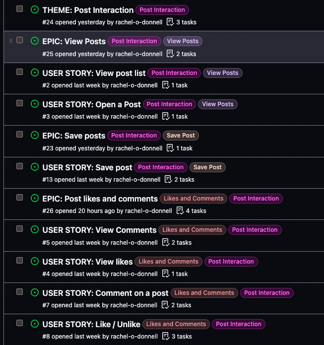

User Stories had acceptance criteria/tasks in the form of check boxes. In this example I tested this feature from the admin panel first and added screenshot in the comments as I know I will have to test this function again after I create the views.

[User Story Acceptance criteria](https://github.com/rachel-o-donnell/the-witchs-cauldron/issues/9) 

All issues were coverted to a Github Kanban project board found in the Github Projects tab or by clicking 

[The Witch's Cauldron Kanban Board](https://github.com/users/rachel-o-donnell/projects/9/views/1)

Product Backlogs were created using the Milestones feature in Github. 1 main product board was created 1st and each iteration was drawn from this board in order of priority.

Product Backlog (main) with MoSCoW labels - Screenshot taken at the start of Iteration 2.

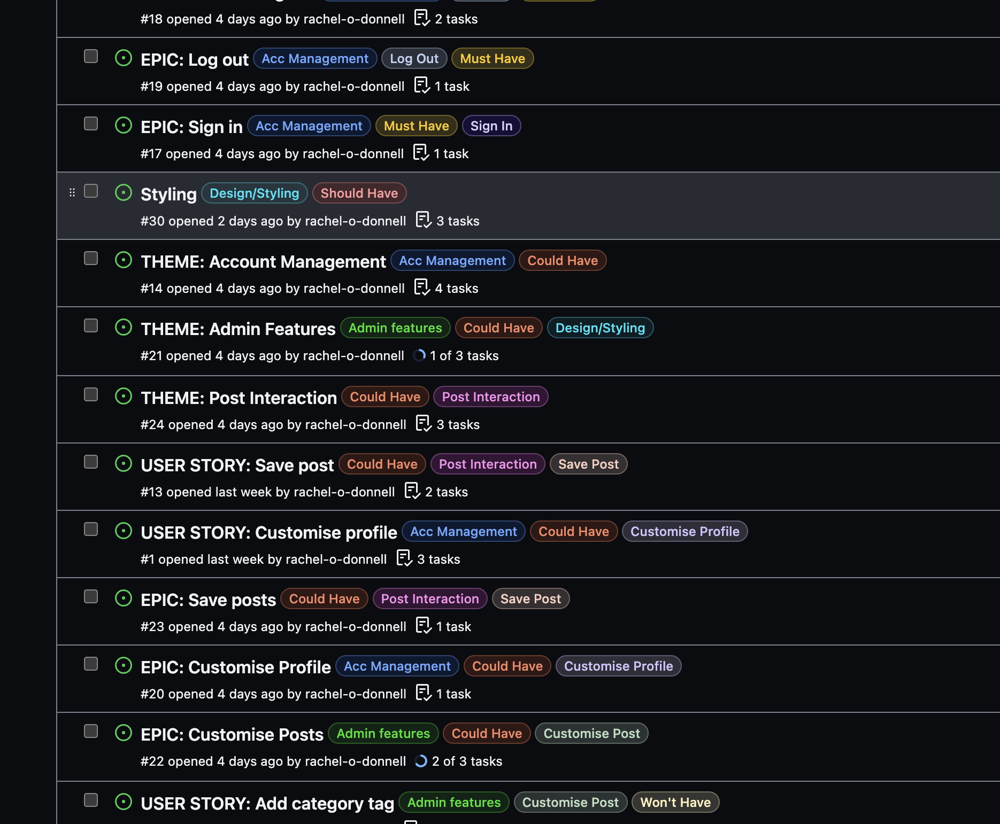

Timeboxing was used by creating Iterations in the Milestones tab of Github with each iteration being one week long. 

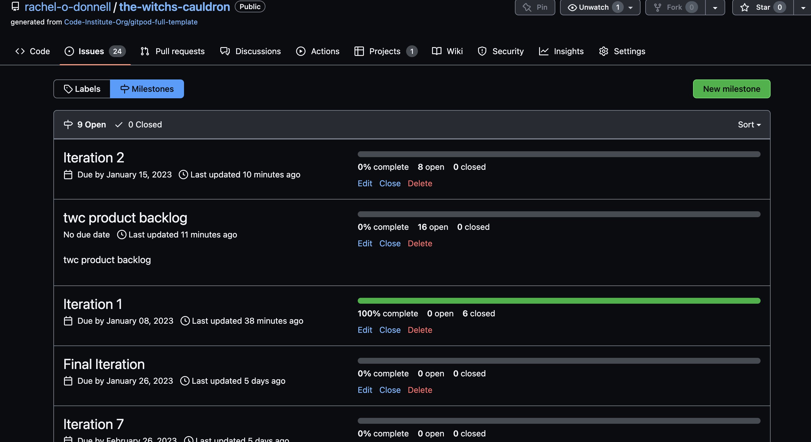

Issues were added to each iteration at the start of each week using MosCow prioritisation (with new labels added to each issue) and using the 60% 20% rest method. These issues were also ordered from top priority on the top of the list down.

Issues that were not completed were added back into the main Product Backlog Milestone at the end of each iteration and the board was reprioritised.

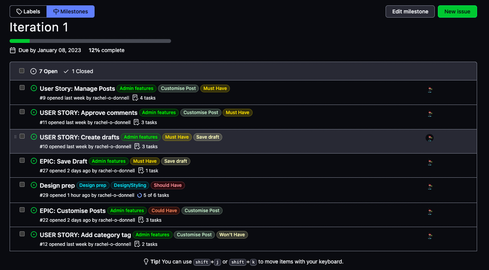

1st week I was ahead of my iteration so I began working on 2nd iteration early.

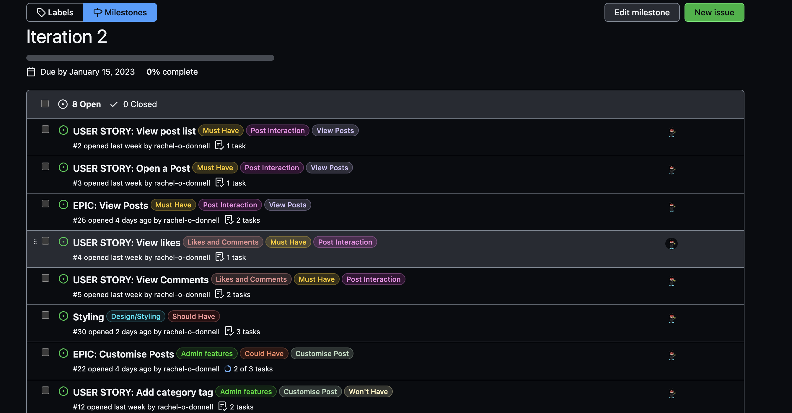

The current iteration led the management of the kanban board- again laid out with a product backlog style in mind with prioritised issues on the top of the list. This helped me visually focus as you could no longer see the MoSCoW labels without clicking into each item. 

Kanban Iteration 1

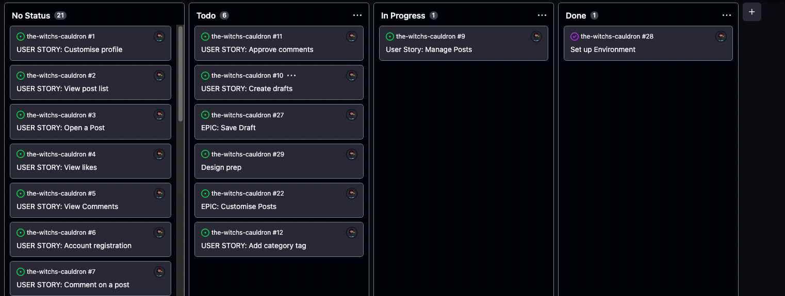

Kanban Iteration 1 Day 4 progress

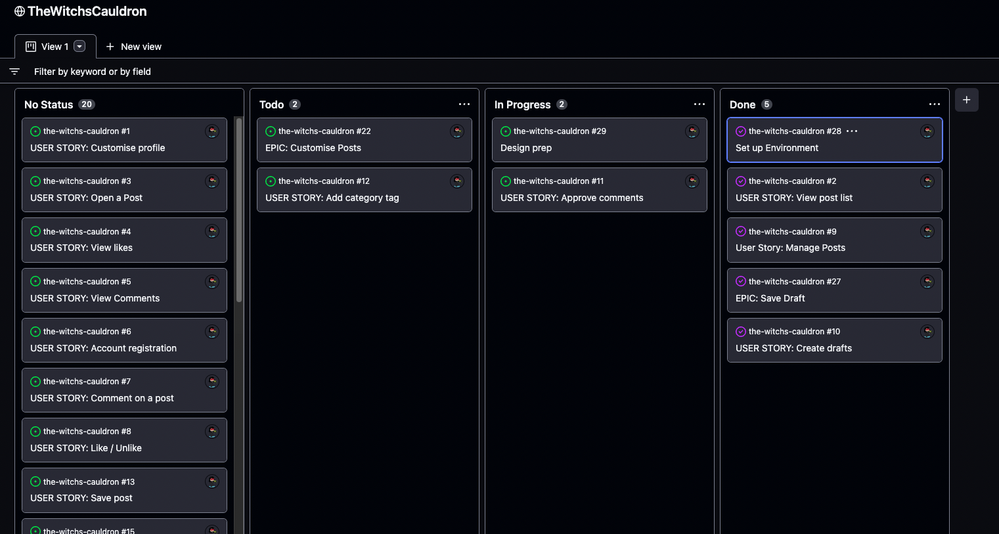 

Kanban Iteration 2 

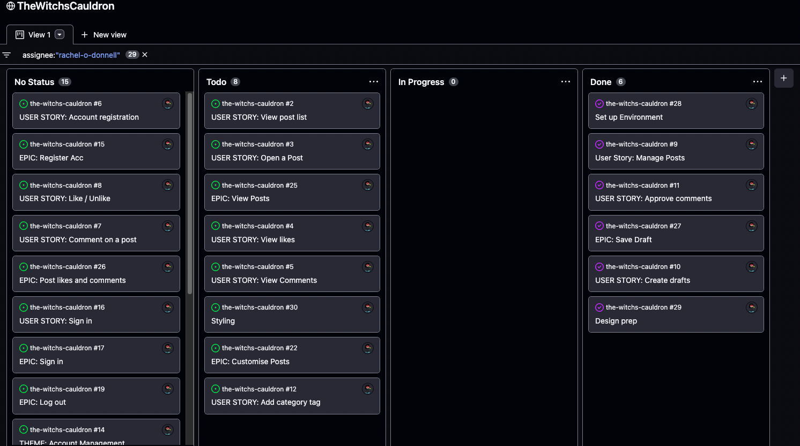

### Design

### Wireframes

Wireframes were created using Balsamiq and can be found [here](assets/Wireframes/)

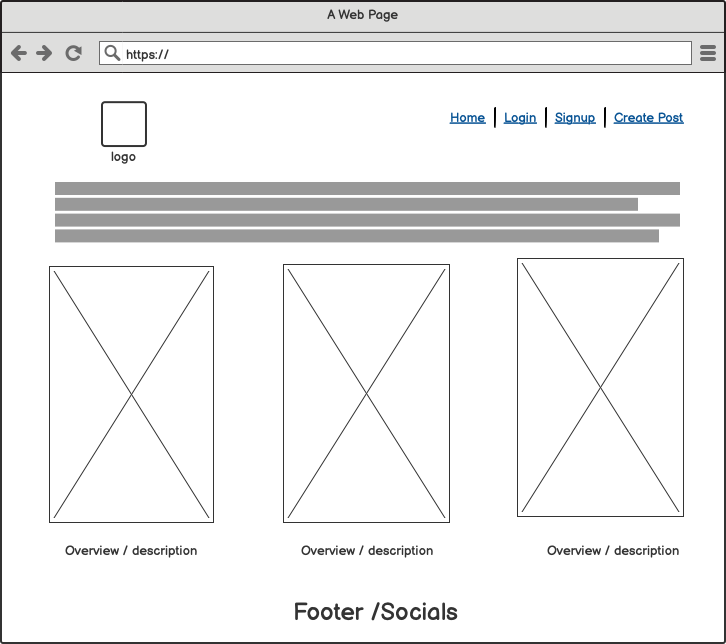

### Colour Scheme

Neutral natural colors were chosen for the site using Coolers. I made every effort for color blind accesability here to ensure all tones would differ. 

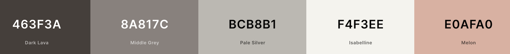

All colorblind variants can be found [here](assets/README-images/colors)

### Typography

Amatic SC - playful and homemade - a nod to the inviting and not so serious nature of the blog.
Amiri - Has an early modern feel like - the classical period of witch hunts.

### Images and Iconography

### Database Schema

### Design changes ???

## Features

1. Home Page

    - 

1. Navigation

    - 

1. Signup, Login and other account management pages

    - 

1. Posts

    - 

1. Admin

    - 

### Features Not Implemented

### Future Features

Contact us  - apply to become an admin/ submit a spell
Sign in/up with social media
Admin profile pages
User Profile pages
Favourites/Saved/Liked posts page
Follow Admin profiles - notifications of their new posts
Notifications of replies to comments
Merch for sale
Books from creators for sale / reccomendations
Admin page on frontend to upload spells

-

## Technologies Used

### Languages Used

- HTML5
- CSS3
- Python

### Python Modules and Packages/Frameworks Used

 - [gunicorn](https://pypi.org/project/gunicorn/20.1.0/) - Gunicorn ‘Green Unicorn’ is a Python WSGI HTTP Server for UNIX. (The server that I am useing to run Django on Heroku)
 - [Django](https://www.djangoproject.com/) - High-level Python Web framework used to build this project rapidly.
 <!-- Not sure if i need to add these
 - [include]
 - [os]
 - [DateTime] - [CharField] etc 
 -->
 
 API: 
 - [cloudinary](https://cloudinary.com/) - Image and Video API
 
 Libraries:
 - [dj-database-url](https://pypi.org/project/dj-database-url/) - Django utility allows use of DATABASE_URL environment variable to configure your Django app.  
    (Support library needed for PostgresSQL - Found in Django settings file to connect to a PostgreSQL database.)
 - [psycopg2](https://pypi.org/project/psycopg2/) - PostgreSQL database adapter for Python. (Connects to PostgresSQL)
 - [dj3-cloudinary-storage](https://pypi.org/project/dj3-cloudinary-storage/) - Django package that facilitates integration with Cloudinary by implementing Django Storage API.
 - [django-summernote](https://summernote.org/) - WISIWYG (what you see is what you get) text editor
 - [django-allauth](https://django-allauth.readthedocs.io/en/latest/) - integrated Django application addressing authentication, registration, account management and sign in from social media. Used to set up an account, like, comment etc.
 - [django-crispy-forms](https://django-crispy-forms.readthedocs.io/en/latest/install.html#installing-django-crispy-forms) - Used for form elements for comments

- [whitenoise] - (https://whitenoise.evans.io/en/latest/) - problem with heroku not reading css 
- widgets? 
 ???
 - [django.contrib.messages]https://docs.djangoproject.com/en/4.1/ref/contrib/messages/
 - [SuccessMessageMixin]
 List of all imports?

Deployment:
 - [Heroku](https://dashboard.heroku.com/) - "Heroku is a platform as a service (PaaS) that enables developers to build, run, and operate applications entirely in the cloud."
 Database:
 - [ElephantSQL](https://www.elephantsql.com/) - "ElephantSQL automates every part of setup and running of PostgreSQL clusters." (Database)

### Programs and Tools Used

- [Google Fonts:](https://fonts.google.com/)- [Bootstrap](https://getbootstrap.com/)

- [Bootstrap](https://getbootstrap.com/
  - Bootstrap was used through the project to style the project and create responsive elements/layouts.

- [drawSQL](https://drawsql.app/) - Create Database Schema/ERD

- [Git](https://git-scm.com/)
  - Git was used for version control, using the terminal to commit to Git and
    Push to GitHub.
- [GitHub:](https://github.com/)
  - GitHub is used to store the projects code after being pushed from Git.
- [Balsamiq:](https://balsamiq.com/)
  - Balsamiq was used to create the [wireframes](#wireframes) during the design
    process.
- [Coolors](https://coolors.co/image-recolor)
- The following modules were installed or enabled in [GitHub]() to assist with formatting and code
linting:

## Testing

Pycodestyle? - pep 8 replacement

Jigsaw Wc3 validation

### Bugs

### Fixed Bugs

#1 Missing comma after 'cloudinary_storage' in INSTALLED_APPS section of Settings.py creating error ModuleNotFoundError: No module named 'cloudinary_storagedjango' found when dry running migration.

#2 in PostSpell/models.py:
 Fix bug#2 in PostSpell/models.py. Missing capital F in CharField and SlugField creating  AttributeError: module 'django.db.models' has no attribute 'Slugfield'/'CharField' found in migration dry run. 

#3 Default image was not displaying - I needed to change the address. image by Jalyn Bryce.

#4 Username and body not displaying in comment section - changed to user.username and comment_area 

#5 Comment area would disapear after adding comment needed to rearrange the code

#6 Heroku deployment crash - 1st fix was an attempt but incorrect - I had not added crispy forms to requirements.txt.

#7 - alert messages were not showing on edit_comment leading me to realised I had not set them up correctly to display. Needed to add custom messages to respective views, -set import a mixin for class based views, set up the call to show the messages in the base.html and override the django/bootsrap clash in settings.

#8 - SuccessMessageMixin does not work on Deleteview https://code.djangoproject.com/ticket/21926 needed to add workound code found https://stackoverflow.com/questions/24822509/success-message-in-deleteview-not-shown ans:Heyl1

#9 - Site not loading after pep8 compliance - undid shortening of lines for pep8 in env.py and settings.py

#10 - Can't have unique=true with a default setting in models. 

#11 - Import User to Views.py 

#12 - Wrong user showing in profile - I was calling User pk instead of Profile pk 

#13 - CSRF token missing error - needed to import and add request context to View AddSpell https://stackoverflow.com/questions/8321217/django-csrf-token-missing-or-incorrect

#14 - Errors in views after deleteing status from model - forgot to remove ALL status calls/filters from views.py

### Remaining Bugs

Like button not changing colour on home screen
Delete messages not displaying
disctortion of list display when looking under categories
like amounts not showing now after restyle?/fixing front end like 

override bootstrap styling on underline- border, dropdown menu etc. 

double submission of form - comments

## Deployment

### Forking the GitHub Repository

### Making a Local Clone

**NOTE**: It is a requirement of the is project that you have Python version 3.8 or higher installed locally.

### Deploying with Heroku

## Credits

### Online resources

- [Django Documentation](https://docs.djangoproject.com/en/3.2/)
- [Bootstrap Documentation](https://getbootstrap.com/docs/5.1) and [Examples](https://getbootstrap.com/docs/5.1/examples/)
- [Django-Summernote Documentation](https://github.com/summernote/django-summernote)
- [Django-Allauth Documentation](https://django-allauth.readthedocs.io/en/latest/)

### Code

Using Code Institute's "I Think Therefore I Blog" runthrough as a base for guidence and adapting as much as possible.

***admin.py - PostAdmin and Admin comment - Add features to expand/make different (minimal I could change here yet- possibly add a category tag if that becomes a feature later on)

Footer - Base code example and addapted to suit the needs and style of the project https://mdbootstrap.com/snippets/standard/mdbootstrap/2885129?view=side

Fixing footer styling to push to the bottom of the screen but not sticky : https://radu.link/make-footer-stay-bottom-page-bootstrap/

Adding Categories model and dropdown view: https://www.youtube.com/watch?v=S9-Bt1JgRjQ

Edit Comment functionality : https://www.youtube.com/watch?v=qYOrepWooV4&list=PLKnjLEpehhFnb210PantMg9sdQNrygxUL&index=42

Messages: https://www.youtube.com/watch?v=2rZqhLo-V14&list=PLKnjLEpehhFnb210PantMg9sdQNrygxUL&index=18 implementing alerts to multiple areas
https://ordinarycoders.com/blog/article/django-messages-framework

Messages on a class based view: https://dev.to/serhatteker/show-message-in-class-based-views-django-4a4d

Adding Profiles:

https://www.devhandbook.com/django/user-profile/
https://www.youtube.com/watch?v=zb4fIvtn4tY Codemy

Adding help text to forms field https://stackoverflow.com/posts/50873523/edit

### Media

### ReadMe 

I used the skeleton of Ian's ReadMe to help me put a structure of my ReadMe together as a starting point.

- https://github.com/ianmeigh/support-hub/blob/main/README.md 

Tips from the below video README: Worth Reading, with Joanna Gorska on the Code Institute Channel.
- https://www.youtube.com/watch?v=P1UiUXrp7Ic

### Acknowledgments

